# OutlineShader材质使用

## 1. 启用描边效果

在场景中创建`后期处理体积`, 选中该`后期处理体积`, 在`后期处理体积设置`中将其设置为`无限范围(未限定)`

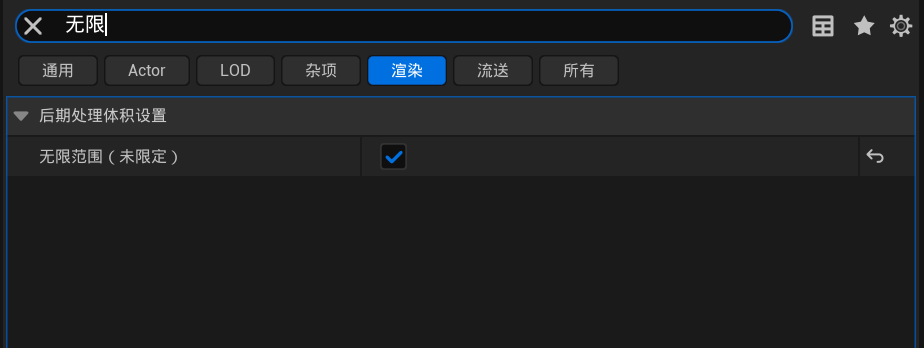

在`渲染功能-后期处理材质中`, 为数组添加数组元素, 并设置为MI_Outline_Inst材质实例

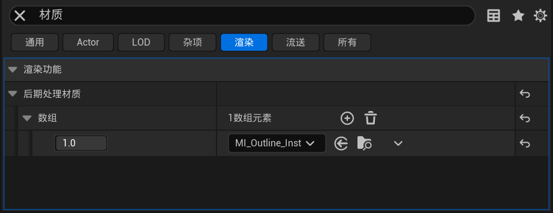

描边效果已启用

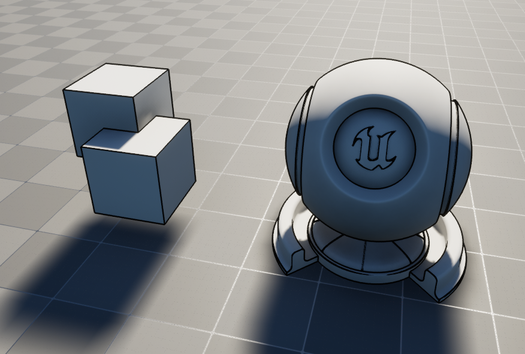

## 2. 参数说明

>未提到的参数是用于修复部分bug, 如非必要请勿修改

`Color Depth Outline`: 物体**深度描边**(外边缘描边)颜色

`Color Normal Outline`: 物体**法线描边**(内部边缘), 如凸起或凹陷的边缘颜色

注意, 外边缘判定条件为两像素距离变化率, 内部边缘颜色判定条件为法线方向变化率, 所以同一条边缘可能会同时使用两种颜色描边

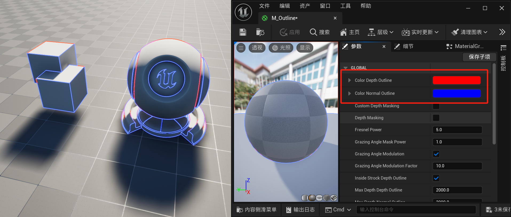

`Depth Masking`: 控制描边是否受到深度信息影响, 当与距离超过`Max Drawing Distance`时, 将不再进行描边(图片见后文`Max Drawing Distance`部分)

`Custom Depth Masking`: 开启后, 只会对场景里`渲染自定义深度通道`的物体进行描边, 详见第三部分`给部分物体进行描边`

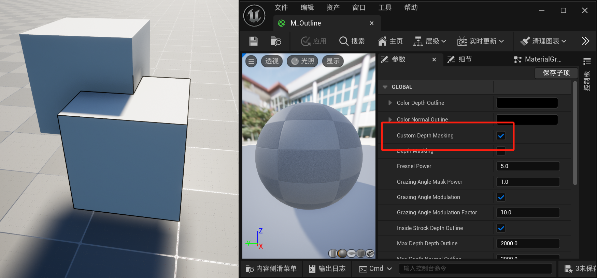

`Max Depth Depth Outline`: 当物体离相机此距离时, 物体的深度描边粗细将到达最细值`Min Thickness Depth Outline`

`Max Depth Normal Outline`: 当物体离相机此距离时, 物体的法线描边粗细将到达最细值`Min Thickness Normal Outline`

`Max Drawing Distance`: 控制描边效果的最大绘制距离, 超过此距离的对象将不会应用描边效果, 此距离的物体一般是用于远处背景搭建, 例如天空中的星球等, 需要同时开启`Depth Masking`

<figure>
  
  <figcaption style="text-align: center;">未开启Depth Masking</figcaption>
</figure>

<figure>
  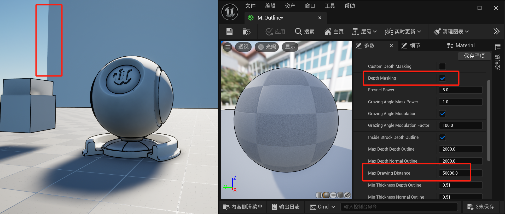
  <figcaption style="text-align: center;">开启Depth Masking, 远处墙壁距离为60000</figcaption>
</figure>

`Min Thickness Depth Outline`: 控制**深度描边**效果的最小厚度(即距离相机最远时的厚度)。较小的值使得描边线条更细

`Min Thickness Normal Outline`: 控制**法线描边**效果的最小厚度(即距离相机最远时的厚度)。较小的值使得描边线条更细

`Thickness Depth Outline`: 控制**深度描边**效果的默认(最大)厚度(即距离相机最近时的厚度),较高的值使得法线描边线条更粗

`Thickness Normal Outline`: 控制**法线描边**效果的默认(最大)厚度(即距离相机最近时的厚度),较高的值使得法线描边线条更粗

`Thickness Modulation`: 不启用时描边粗细将不会变化, 启用后, 描边的粗细会根据相机与物体的距离进行相应的变化, 距离越远越细, 越近越粗, 具体值由以上四个参数决定

<figure>
  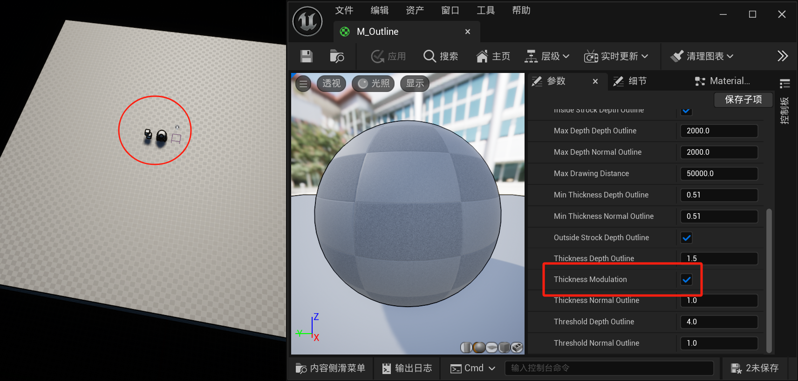
  <figcaption style="text-align: center;">开启Thickness Modulation, 距离较远时边缘较细</figcaption>
</figure>

<figure>
  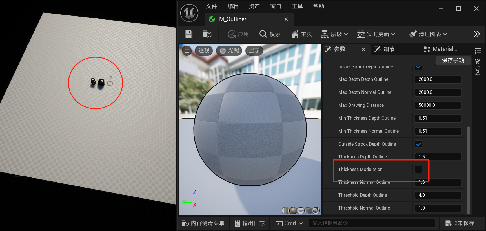
  <figcaption style="text-align: center;">未开启Thickness Modulation, 距离较远时边缘仍然较粗</figcaption>
</figure>

`Threshold Depth Outline`:控制**深度描边**效果的阈值, 数值代表**深度描边**所需的两个像素深度距离的变化率, 数值越大则越难触发

`Threshold Normal Outline`:控制**法线描边**效果的阈值, 数值代表**法线描边**所需法线方向的变化率, 数值越大则越难触发

## 3. 给部分物体进行描边

如果只想给场景中部分物体进行描边, 则需要开启`Custom Depth Masking`选项

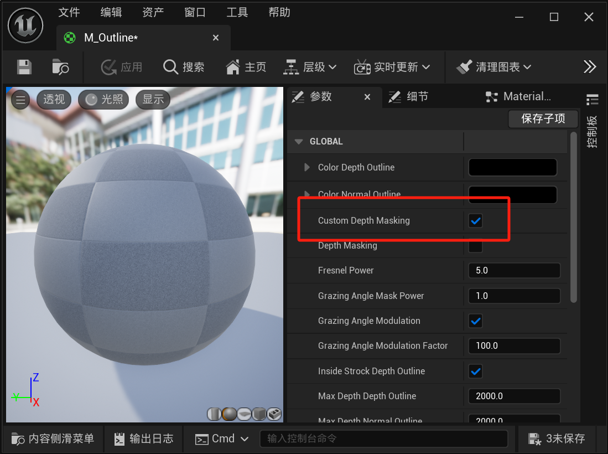

同时, 在场景中选中想要开启描边的物体, 勾选`渲染-高级-渲染自定义深度通道`

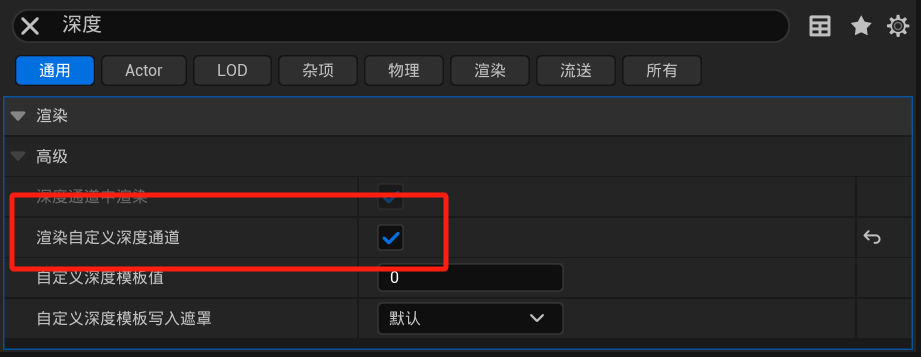

此时, 勾选了该选项的物体才会开启描边效果

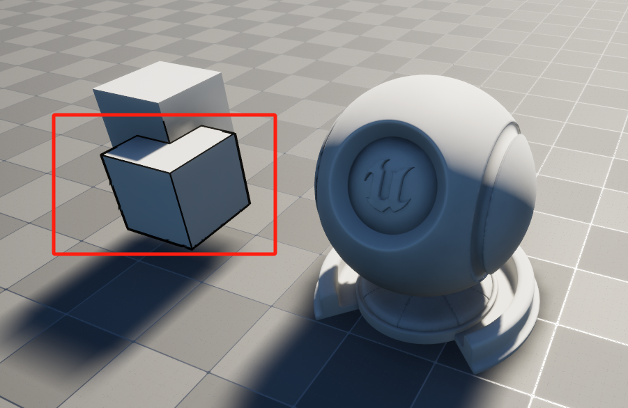
